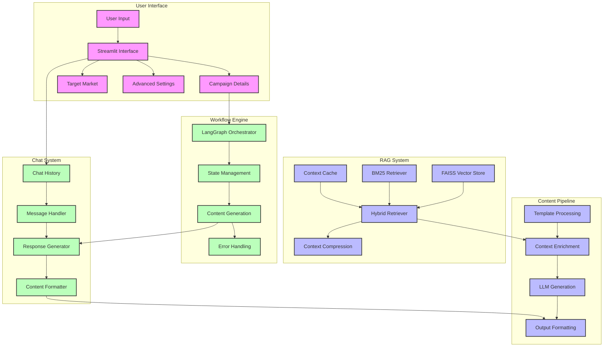

# Pwani Oil Marketing Content Generator - System Flow Diagram

## Component Descriptions

### User Interface
- **User Input**: Handles initial user requests and parameters
- **Streamlit Interface**: Main web interface for user interaction
- **Campaign Details**: Campaign configuration and parameters
- **Target Market**: Market segmentation and targeting options
- **Advanced Settings**: System configuration and LLM parameters

### RAG System
- **FAISS Vector Store**: Efficient vector storage and retrieval
- **Hybrid Retriever**: Combines BM25 and vector search
- **Context Cache**: Caches frequently accessed contexts
- **Context Compression**: Optimizes retrieved context

### Workflow Engine
- **LangGraph Orchestrator**: Manages content generation flow
- **State Management**: Handles workflow state and transitions
- **Content Generation**: Core content creation process
- **Error Handling**: Manages errors and fallbacks

### Chat System
- **Chat History**: Maintains conversation context
- **Message Handler**: Processes incoming/outgoing messages
- **Response Generator**: Generates contextual responses
- **Content Formatter**: Formats output for display

### Content Pipeline
- **Template Processing**: Handles content templates
- **Context Enrichment**: Enhances content with context
- **LLM Generation**: Language model interaction
- **Output Formatting**: Final content formatting